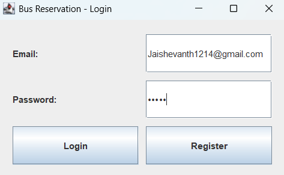
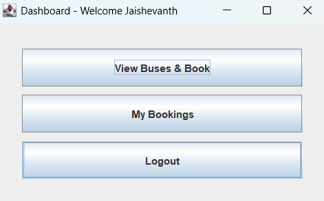

🚍 SmartBus – Java-Based Ticketing & Reservation System

A **Java Swing + JDBC + MySQL** based desktop application for managing bus ticket bookings.  
This project demonstrates core Java concepts, GUI development, and database integration — a perfect showcase for Java developer roles.

---

✨ Features
- 🔑 **User Authentication** – Register & Login functionality  
- 🚌 **View Available Buses** – Display route, date, fare, and seats in real-time  
- 🎟 **Ticket Booking** – Book seats & auto-update seat availability  
- 📋 **Booking History** – View previous bookings & status  
- ❌ **Ticket Cancellation** – Cancel booked tickets and restore seat count  
- 🗄 **Database Integration** – All records stored in MySQL  

---

🛠 Tech Stack
- **Java** – Core Java & Swing (GUI)  
- **JDBC** – For database connectivity  
- **MySQL** – Relational database  
- **Eclipse IDE** – Project development (non-Maven)  

---

## 📂 Project Structure
BusReservationSystem/
├── src/com/bus/reservation
│ ├── main - Main entry point
│ ├── dao - Data Access Layer (interacts with DB)
│ ├── model - POJOs (User, Bus, Booking)
│ ├── service - Business logic
│ └── util - DB connection utility

🚀 How to Run
1. Clone the repo:  
   ```bash
   git clone https://github.com/Jaishevanth-JS/SmartBus-Java-Reservation-System.git 
2. Import into Eclipse IDE (File → Import → Existing Projects).
3. Set up MySQL database:
CREATE DATABASE bus_reservation;
USE bus_reservation;

CREATE TABLE users (
    id INT AUTO_INCREMENT PRIMARY KEY,
    name VARCHAR(100),
    email VARCHAR(100) UNIQUE,
    password VARCHAR(100)
);

CREATE TABLE buses (
    id INT AUTO_INCREMENT PRIMARY KEY,
    bus_number VARCHAR(50),
    source VARCHAR(100),
    destination VARCHAR(100),
    date VARCHAR(20),
    total_seats INT,
    available_seats INT,
    fare DOUBLE
);

CREATE TABLE bookings (
    id INT AUTO_INCREMENT PRIMARY KEY,
    user_id INT,
    bus_id INT,
    seats_booked INT,
    status VARCHAR(50),
    booking_date TIMESTAMP DEFAULT CURRENT_TIMESTAMP,
    FOREIGN KEY (user_id) REFERENCES users(id),
    FOREIGN KEY (bus_id) REFERENCES buses(id)
);

4. Insert sample buses:
INSERT INTO buses (bus_number, source, destination, date, total_seats, available_seats, fare)
VALUES
('BUS1001', 'Chennai', 'Bangalore', '2025-09-01', 40, 40, 550.0),
('BUS1002', 'Hyderabad', 'Chennai', '2025-09-02', 50, 50, 700.0),
('BUS1003', 'Bangalore', 'Mumbai', '2025-09-03', 50, 50, 1200.0),
('BUS1004', 'Delhi', 'Jaipur', '2025-09-01', 30, 30, 400.0);

5. Update DB credentials inside:
src/com/bus/reservation/util/DBConnection.java

private static final String URL = "jdbc:mysql://localhost:3306/bus_reservation?useSSL=false&serverTimezone=UTC";
private static final String USER = "root";
private static final String PASSWORD = "your_password";

6.Run the app → SmartBus GUI will open. 🎉

📸 Screenshots

### 🔑 Login Page


### 🏠 Dashboard
  

### 🚌 Bus List Page


### 🎟 Booking Confirmation


## 👨‍💻 Author
**Jaishevanth J S**  
🔗 [GitHub Profile](https://github.com/Jaishevanth-JS)  
🔗 [LinkedIn Profile](https://www.linkedin.com/in/jaishevanth-js/)  

